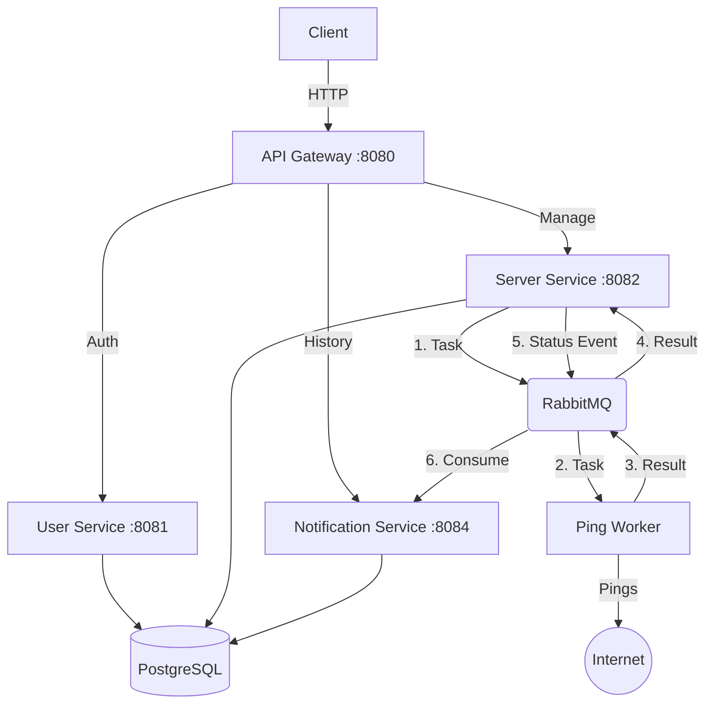

# 📡 StaSHus
### Distributed Server Availability Monitoring System


<p>
  <b>StaSHus</b> — это отказоустойчивая распределенная система для мониторинга доступности серверов в реальном времени. 
  Построена на принципах микросервисной архитектуры с использованием асинхронного взаимодействия.
</p>

[🚀 О проекте](#-о-проекте) • [🏗 Архитектура](#-архитектура) • [🔮 Roadmap](#-roadmap--todo) • [⚡ Запуск](#-быстрый-старт)

---

## 🚀 О проекте

**StaSHus** решает задачу автоматизированного контроля состояния ("Health Check") удаленных ресурсов. Система позволяет пользователям регистрировать серверы для отслеживания, автоматически пингует их по заданному интервалу и сохраняет историю инцидентов.

В текущей версии реализован полный **Backend API**, готовый к интеграции с любым клиентом.

### Ключевые особенности:
* 🔐 **JWT Security:** Полная защита API через Gateway (валидация токенов, проброс заголовков).
* ⚡ **Async Processing:** Использование RabbitMQ для неблокирующей обработки событий смены статуса.
* 🐳 **Container Native:** Полная докеризация всех компонентов (БД, Брокер, Сервисы).
* 📈 **Scalability:** Горизонтальное масштабирование слоя воркеров позволяет линейно наращивать производительность системы при увеличении числа отслеживаемых хостов без перегрузки основного ядра.
* 📄 **OpenAPI Documentation:** Интегрированный Swagger UI для визуализации API и тестирования запросов прямо из браузера.
---

## 🏗 Архитектура

Система реализует паттерн **API Gateway** как единую точку входа.
В основе лежит разделение на Планировщика и Исполнителей:
1. **Server Service** по расписанию создает задачи на проверку серверов и кидает их в очередь RabbitMQ.


2. **Ping Workers** разбирают эти задачи, делают реальный HTTP-запрос и возвращают результат обратно в очередь.

Это позволяет системе не зависать при большом количестве проверок и легко добавлять новых воркеров, если нагрузка вырастет.


| Микросервис          | Порт | Описание                                                    | Технологии               |
|:---------------------|:-----|:------------------------------------------------------------|:-------------------------|
| API Gateway          | 8080 | Единая точка входа, маршрутизация, валидация JWT.           | Spring Cloud Gateway     |
| User Service         | 8081 | Регистрация, аутентификация, выдача токенов.                | Spring Security, JPA     |
| Server Service       | 8082 | CRUD серверов, Оркестрация проверок, обработка результатов. | REST, JPA                |
| Ping Worker          |      | Stateless Worker. Выполняет задачи на проверку доступности. | Java Net, RabbitTemplate |
| Notification Service | 8084 | Агрегация истории событий и уведомления.                    | RabbitListener, JPA      |

---

## 🔮 Roadmap & TODO

Проект активно развивается. На данный момент реализовано ядро системы (Backend MVP).
Ниже представлены планы по расширению функционала:

### 📚 Документация
* [x] **Swagger UI:** Внедрение интерактивной документации API.

### 💾 Оптимизация и Производительность

* [ ] **Caching (Redis):** Внедрение Redis для кэширования часто запрашиваемых данных, таких как информация о пользователях и конфигурация отслеживаемых серверов, с целью снижения нагрузки на основную PostgreSQL базу данных.

### 🔔 Система уведомлений (Smart Alerts)

Планируется внедрение гибкой настройки каналов оповещения. Пользователь сможет выбирать, куда получать алерты о падении серверов:

* [ ] **Telegram Bot:** Интеграция с Telegram API для мгновенных пушей.
* [ ] **Email Notifications:** Отправка отчетов через SMTP.

---

## 🛠 Инфраструктура

Для запуска окружения используется docker-compose.

| Сервис      | Внутренний порт | Внешний порт | Назначение                                      |
|:------------|:----------------|:-------------|:------------------------------------------------|
| PostgreSQL  | 5432            |              | Основное хранилище данных (User/Server/Logs).   |
| RabbitMQ    | 5672            |              | Брокер сообщений для событий изменения статуса. |
| RabbitMQ UI | 15672           | 15672        | Веб-интерфейс управления очередями.             |
| pgAdmin     | 80              | 5050         | Визуальное управление базой данных.             |

---

## ⚡ Быстрый старт

1. Клонирование репозитория

```bash
git clone https://github.com/SlavikHom/StaSHus.git
cd stashus
```

2. Запуск системы

```bash
docker-compose up -d
```

Это поднимет **PostgreSQL**, **RabbitMQ** и **все микросервисы**.

3. Проверка статуса
   
Убедитесь, что все 8 контейнеров запущены и работают

```bash
docker ps
```

---

## 👾 API Reference (Примеры)

Для удобного взаимодействия с системой используйте Swagger UI.
Он доступен по адресу: **http://localhost:8080/webjars/swagger-ui/index.html** 

Ниже приведены примеры "сырых" запросов для терминала:

1. Регистрация и Вход

```bash
# Регистрация
curl -X POST http://localhost:8080/auth/signup \
-H "Content-Type: application/json" \
-d '{"handle": "user", "email": "user@stashus.com", "password": "password"}'

# Вход (Получение токена)
curl -X POST http://localhost:8080/auth/signin \
-H "Content-Type: application/json" \
-d '{"handle": "user", "password": "password"}'
```

> В ответ придет JWT токен. Используйте его в заголовке **Authorization: Bearer <YOUR_JWT_TOKEN>** для следующих запросов.

2. Управление серверами

```bash
# Добавить сервер для мониторинга
curl -X POST http://localhost:8080/servers \
-H "Authorization: Bearer <YOUR_JWT_TOKEN>" \
-H "Content-Type: application/json" \
-d '{"address": "google.com"}'
```

3. Просмотр истории

```bash
# Получить список инцидентов
curl -X GET http://localhost:8080/notifications/history \
-H "Authorization: Bearer <YOUR_JWT_TOKEN>"
```

---

<div align="center"> <sub>Developed by SlavikHom for educational purposes. 2026.</sub> </div>
