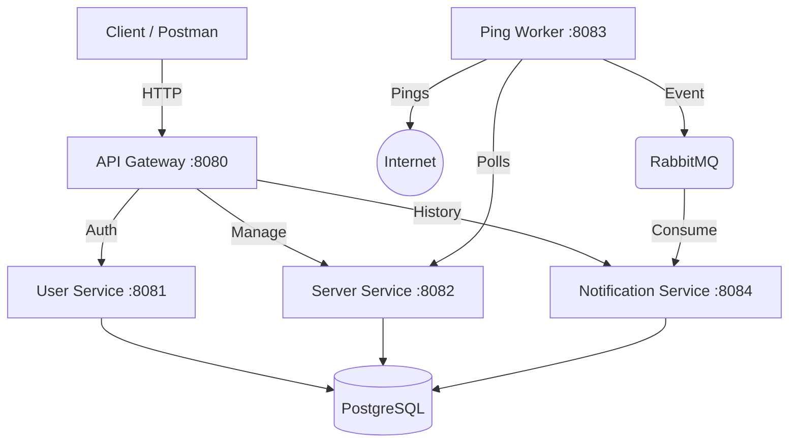

# 📡 StaSHus
### Distributed Server Availability Monitoring System


<p>
  <b>StaSHus</b> — это отказоустойчивая распределенная система для мониторинга доступности серверов в реальном времени. 
  Построена на принципах микросервисной архитектуры с использованием асинхронного взаимодействия.
</p>

[🚀 О проекте](#-о-проекте) • [🏗 Архитектура](#-архитектура) • [🔮 Roadmap](#-roadmap--todo) • [⚡ Запуск](#-быстрый-старт)

</div>

---

## 🚀 О проекте

**StaSHus** решает задачу автоматизированного контроля состояния ("Health Check") удаленных ресурсов. Система позволяет пользователям регистрировать серверы для отслеживания, автоматически пингует их по заданному интервалу и сохраняет историю инцидентов.

В текущей версии реализован полный **Backend API**, готовый к интеграции с любым клиентом.

### Ключевые особенности:
* 🔐 **JWT Security:** Полная защита API через Gateway (валидация токенов, проброс заголовков).
* ⚡ **Async Processing:** Использование RabbitMQ для неблокирующей обработки событий смены статуса.
* 🐳 **Container Native:** Полная докеризация всех компонентов (БД, Брокер, Сервисы).
* 📈 **Scalability:** Независимое масштабирование воркеров (Ping Workers).

---

## 🏗 Архитектура

Система реализует паттерн **API Gateway** как единую точку входа. Взаимодействие между воркерами и сервисом уведомлений происходит асинхронно через очередь сообщений.


| Микросервис | Порт | Описание | Технологии |
| :--- | :--- | :--- | :--- |
| API Gateway | 8080 | Единая точка входа, маршрутизация, валидация JWT. | Spring Cloud Gateway |
| User Service | 8081 | Регистрация, аутентификация, выдача токенов. | Spring Security, JPA |
| Server Service | 8082 | CRUD операции над списком серверов. | REST, JPA |
| Ping Worker | 8083 | Фоновый процесс проверки доступности (Scheduled). | Java Net, RabbitTemplate |
| Notification Service | 8084 | Агрегация истории событий и уведомления. | RabbitListener, JPA |

---

## 🔮 Roadmap & TODO

Проект активно развивается. На данный момент реализовано ядро системы (Backend MVP).
Ниже представлены планы по расширению функционала:

### 🖥️ Frontend

* [ ] **Web Dashboard:** Разработка SPA (Single Page Application) на React/Vue для визуализации списка серверов и доступности.

### 🔔 Система уведомлений (Smart Alerts)

Планируется внедрение гибкой настройки каналов оповещения. Пользователь сможет выбирать, куда получать алерты о падении серверов:

* [ ] **Telegram Bot:** Интеграция с Telegram API для мгновенных пушей.
* [ ] **Email Notifications:** Отправка отчетов через SMTP.

---

## 🛠 Инфраструктура

Для запуска окружения используется docker-compose.

| Сервис | Внутренний порт | Внешний порт | Назначение |
| :--- | :--- | :--- | :--- |
| PostgreSQL | 5432 | 5432 | Основное хранилище данных (User/Server/Logs). |
| RabbitMQ | 5672 | 5672 | Брокер сообщений для событий изменения статуса. |
| RabbitMQ UI | 15672 | 15672 | Веб-интерфейс управления очередями. |
| pgAdmin | 80 | 5050 | Визуальное управление базой данных. |

---

## ⚡ Быстрый старт

1. Клонирование репозитория

```bash
git clone [https://github.com/your-username/stashus.git](https://github.com/your-username/stashus.git)
cd stashus
```

2. Запуск инфраструктуры

```bash
docker-compose up -d
```

Это поднимет **PostgreSQL**, **RabbitMQ** и **Redis**.

3. Сборка и запуск сервисов

```bash
mvn spring-boot:run
```

---

## 👾 API Reference (Примеры)

1. Регистрация и Вход

```bash
# Регистрация
curl -X POST http://localhost:8080/auth/signup \
-H "Content-Type: application/json" \
-d '{"handle": "user", "email": "user@stashus.com", "password": "password"}'

# Вход (Получение токена)
curl -X POST http://localhost:8080/auth/signin \
-H "Content-Type: application/json" \
-d '{"handle": "user", "password": "password"}'
```

> В ответ придет JWT токен. Используйте его в заголовке **Authorization: Bearer <YOUR_JWT_TOKEN>** для следующих запросов.

2. Управление серверами

```bash
# Добавить сервер для мониторинга
curl -X POST http://localhost:8080/servers \
-H "Authorization: Bearer <YOUR_JWT_TOKEN>" \
-H "Content-Type: application/json" \
-d '{"address": "google.com", "checkInterval": 30}'
```

3. Просмотр истории

```bash
# Получить список инцидентов
curl -X GET http://localhost:8080/notifications/history \
-H "Authorization: Bearer <YOUR_JWT_TOKEN>"
```

---

<div align="center"> <sub>Developed by SlavikHom for educational purposes. 2025.</sub> </div>
